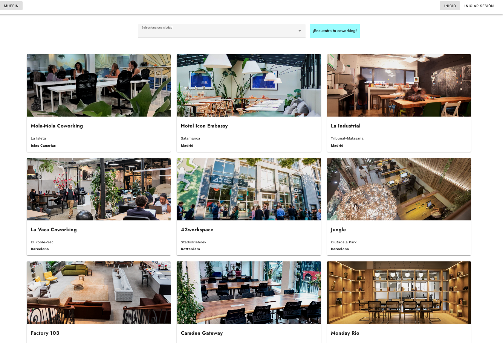
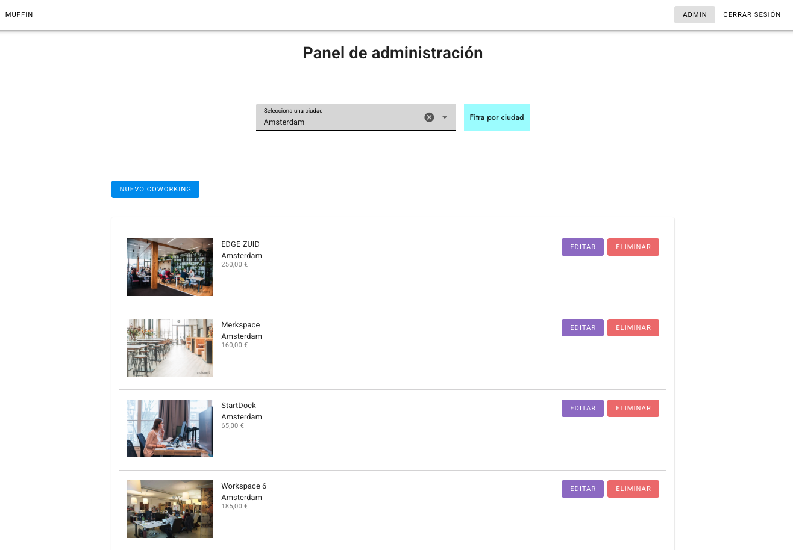

# Coworking Finder — Plataforma de Gestión de Espacios de Trabajo con Vue + Firebase


---

## 📄 Descripción

**Coworking Finder** es una plataforma full stack desarrollada con **Vue.js** y **Firebase**, orientada a la gestión y descubrimiento de espacios de trabajo compartido. Integra autenticación segura, base de datos en tiempo real y almacenamiento de imágenes, brindando una experiencia fluida y escalable tanto para usuarios como administradores.

---

## 🌐 Demo

🔗 [muffin-app](https://muffin-app-vue-firebase.vercel.app/)


---

## 🖼️ Capturas

#### Vista de inicio


#### Panel de administración


#### Registro de coworking


---

## ✨ Funcionalidades

- Autenticación de usuarios con **Firebase Auth**
- Visualización de espacios coworking con filtros por provincia
- Alta, edición y eliminación de coworkings (Admin)
- Subida y eliminación de imágenes con Firebase Storage
- Validación personalizada de formularios
- Gestión de estado global con **Pinia**
- Mapa interactivo con selección de ubicación
- UI responsive con **Vuetify** y carga asíncrona
- Protección de rutas con middlewares y control de acceso

---

## 💻 Tecnologías Utilizadas

### Frontend
- **Vue.js 3** (Composition API)
- **Pinia**
- **Vue Router**
- **Vuetify**
- **Tailwind CSS** (opcional complementario)

### Backend / Servicios
- **Firebase Auth**
- **Firebase Firestore (Realtime DB)**
- **Firebase Storage**
- **VueFire**

---

## 📋 Requisitos

- Node.js v18 o superior
- Cuenta de Firebase con Auth, Firestore y Storage habilitados
- Git

---

## 🧱 Estructura del Proyecto

```bash
Coworking-Finder/
├── src/
│   ├── assets/                # Estilos y recursos
│   ├── components/            # Coworking.vue, Spinner.vue
│   ├── composables/           # Lógica reutilizable (imagen, mapa, CRUD)
│   ├── config/                # Configuración de Firebase
│   ├── helpers/               # Utilidades comunes
│   ├── stores/                # Estado global (auth)
│   ├── router/                # Enrutador con rutas protegidas
│   ├── validation/            # Validaciones personalizadas
│   ├── views/                 # Vistas generales y de administración
│   └── App.vue / main.js      # Entrada principal
├── vite.config.js
└── vercel.json               # Configuración para despliegue
```
---


## 🛠️ Instalación

```bash
git clone https://github.com/eze-ms/Muffin-App

```

### Instalar dependencias del backend
```bash
npm install
```

### Iniciar servidor
```bash
npm run dev
```
---

© 2024. Proyecto desarrollado por Ezequiel Macchi Seoane